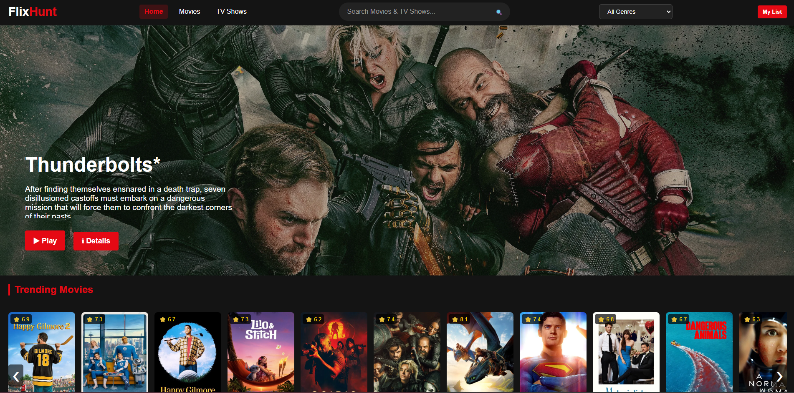
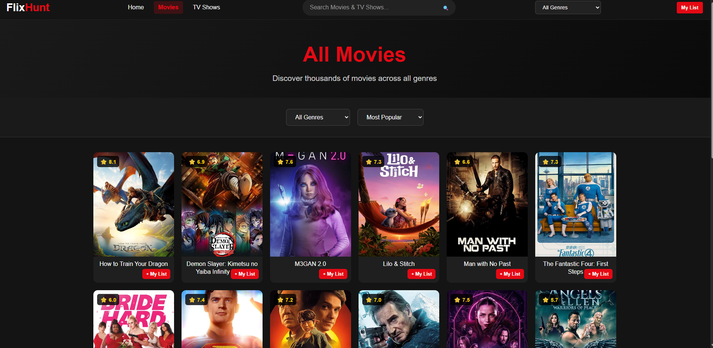
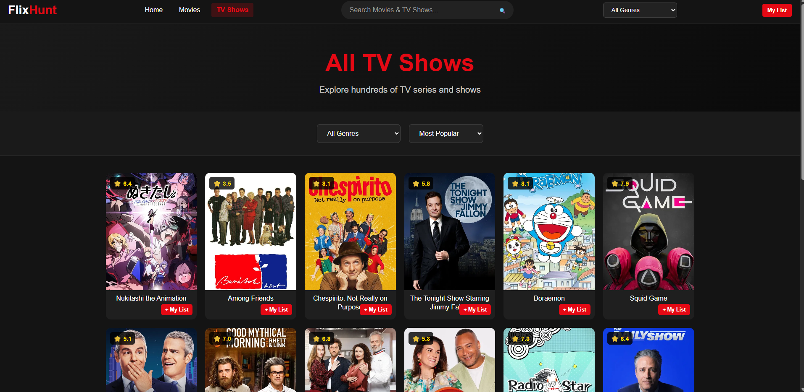

# 🎬 FlixHunt

**Live Demo:** 🔗 [flixhunt.netlify.app](https://flixhunt.netlify.app)  

FlixHunt is a **Netflix-inspired movie and TV show discovery platform** where users can explore trending content, filter by genres, view detailed information, and add favorites to their wishlist — all with a sleek, Netflix-like UI.  

---

## ✨ Features
- 🔥 **Trending Movies & TV Shows** – Powered by **TMDB API**   
- 🎭 **Genre Filtering** – Browse content by Action, Comedy, Romance, etc.  
- ❤️ **Wishlist Support** – Add or remove favorites in one click  
- 📱 **Responsive Design** – Netflix-style UI, optimized for mobile & desktop  

---

## 🛠 Tech Stack
- **HTML5** & **CSS3** (Netflix-inspired UI)  
- **JavaScript (Vanilla)** for dynamic content loading  
- **TMDB API** for movies & TV shows  
- **LocalStorage** for saving wishlist data  
- **Netlify** for deployment  

---

## 📸 Screenshots

| Home Page | Movies Page | TV Shows Page |
|-----------|------------|------------|
|  |  |  |

---

## 🌐 Live Demo
🔗 **[flixhunt.netlify.app](https://flixhunt.netlify.app)**  

---

### 👨‍💻 Developed By
**Muhammad Umair**  
Feel free to ⭐ star or fork the project!

